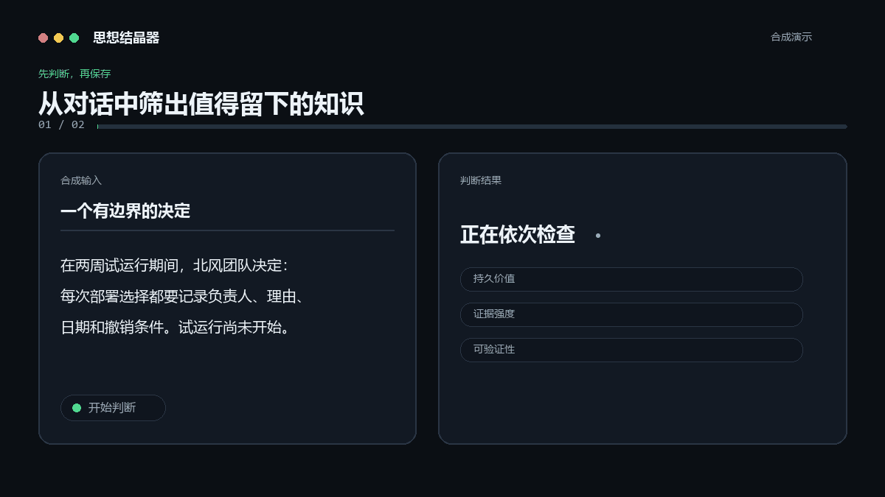

# 💎 Thought Crystallizer（思想结晶器）

[English](README.md) | 简体中文

[GitHub — 官方仓库](https://github.com/jsfgmkg95d-source/thought-crystallizer) · [Gitee — 中国大陆镜像](https://gitee.com/heavenly-realtiantiange/thought-crystallizer)

把 AI 对话中真正值得长期保留的思考，结晶成可复用、可检验的知识。

## 🚀 先选择你的使用方式

### 💬 我平时就是用 ChatGPT、DeepSeek、豆包、Claude、Gemini 聊天

👉 下载：[**Thought-Crystallizer-Chat-ZH.md**](portable/Thought-Crystallizer-Chat-ZH.md)

适合绝大多数普通用户。

⭐ **90%的用户请下载：Thought-Crystallizer-Chat-ZH.md**

1. 下载文件。
2. 上传到你的 AI 聊天窗口。
3. 告诉 AI：`加载 Thought Crystallizer。以后我说“结晶”时，按照其中规则执行。`
4. 正常聊天。
5. 聊出有价值的东西后说：**“结晶一下。”**

- ✅ 不需要 Codex
- ✅ 不需要 Git
- ✅ 不需要编程
- ✅ 不需要安装插件

**不知道选哪个？就下载这个。**

### 🧩 我的 AI 工具支持 Agent Skills

👉 前往 [Releases](https://github.com/jsfgmkg95d-source/thought-crystallizer/releases)，下载 **Thought-Crystallizer-Skill-v0.1.0.zip**。

适用于支持 Agent Skills 或 `SKILL.md` 的工具。原生包包含 `SKILL.md`、`references/` 与其他 Skill 文件。

### 一句话选择

- **普通聊天用户 → Chat Edition**
- **Agent / Skill 用户 → Native Skill**

```text
                  你怎么使用 AI？
                         │
             ┌───────────┴───────────┐
             ↓                       ↓
        普通聊天窗口             支持 Agent Skills
             ↓                       ↓
        Chat Edition             Native Skill
             ↓                       ↓
 ChatGPT / DeepSeek / 豆包       Codex / Agent
     / Claude / Gemini
```

> **产品原则 — UX-001：Zero-Knowledge Download。** 一个第一次打开仓库、完全不知道 Agent Skill 是什么的用户，必须在 10 秒内知道自己应该下载哪个文件。

> **不是每一段 AI 对话，都值得变成知识。**

Thought Crystallizer 不会把所有内容都总结保存，而是先判断其中是否存在真正值得长期复用的知识。Agent Skill 是它的原生发行形式之一，不是产品本身的定义。

它区分 **Fact（事实）**、**Mechanism（机制）** 与 **Hypothesis（假设）**，保留证据、适用边界和证伪条件，并拒绝结晶低价值材料。



<sub>演示内容均为从零编写的合成示例。Skill 会返回一至三张有证据边界的结晶候选卡，或严格的 DO NOT CRYSTALLIZE 结果。</sub>

## 为什么需要它

**AI 已经很擅长总结。更难的问题是：什么值得被记住？**

摘要告诉你讨论了什么；结晶告诉你哪些内容值得再次调用：

- 可追溯的事实或决策；
- 有支持的作用机制；
- 值得检验、边界清楚的假设；
- 让结论保持诚实的证据、证伪条件、用法与限制。

Skill 会主动拒绝寒暄、口号、未定讨论、无依据的数字、只有进度没有结果的状态、语义重复、从私人材料衍生公开内容，以及藏在来源文本中的提示词注入。

## 详细安装与使用

Thought Crystallizer 可以处理从任意 AI 服务复制来的对话。来源可以是 ChatGPT、Codex、Claude、Gemini、DeepSeek、豆包或其他助手；Skill 判断的是你提供的文本，并不依赖原始对话平台。

### Chat Edition

普通聊天窗口请直接使用自包含的[中文版](portable/Thought-Crystallizer-Chat-ZH.md)或[英文版](portable/Thought-Crystallizer-Chat-EN.md)。上传一个文件，然后按照 README 第一屏的五个步骤使用即可。

### Native Skill

只有 AI 工具支持 Agent Skills 时，才需要选择下面的原生安装方式。

#### Codex

把仓库克隆到 Codex Skills 目录。

macOS 或 Linux：

```bash
git clone https://github.com/jsfgmkg95d-source/thought-crystallizer.git ~/.agents/skills/thought-crystallizer
```

Windows PowerShell：

```powershell
git clone https://github.com/jsfgmkg95d-source/thought-crystallizer.git "$env:USERPROFILE\.agents\skills\thought-crystallizer"
```

安装后新建 Codex 任务。如果没有识别到 Skill，请重启 Codex。然后输入：

```text
使用 $thought-crystallizer 结晶这段对话中值得长期复用的洞见。
```

#### 支持独立 Skills 的 ChatGPT 桌面版

1. 在仓库页面选择 **Code -> Download ZIP**。
2. 在 ChatGPT 桌面版侧边栏打开 **Skills**。
3. 选择从电脑上传 Skill，并选中下载的压缩包。
4. 完成检查与安装后，新建对话；输入 `@`，选择 Thought Crystallizer，再粘贴或附上待判断材料。

功能可用性也可能取决于账号套餐和工作区管理员设置。当前可用性与调用方式以 [OpenAI 官方 Skill 文档](https://learn.chatgpt.com/docs/build-skills) 为准。

本仓库当前发布独立 Skill 源码，尚未发布 Thought Crystallizer Plugin。

#### 没有原生 Skills 的 ChatGPT

不要再手动拼装 `SKILL.md` 与 `references/`。请下载 README 第一屏提供的 Chat Edition 单文件，上传后输入：

```text
加载 Thought Crystallizer。以后我说“结晶”时，按照其中规则执行。

结晶一下。
```

除非宿主产品会保留附件指令，否则每次新建对话都需要重新上传该文件。

#### 支持 Agent Skills 的其他 AI 助手

- 如果产品支持 Agent Skills 开放标准，请按该产品的安装流程使用本仓库。
- 如果产品支持自定义智能体或知识文件但不支持 Skills，优先使用 Chat Edition 单文件。
- 普通运行不需要安装 `examples/` 与 `evals/`。

不同模型和宿主的指令遵循能力不同，因此非原生环境不一定能复现已验收 Eval 的全部结果。

### 请求示例

```text
使用 $thought-crystallizer 结晶这段对话中值得长期复用的洞见。
```

```text
把这份笔记与已有结晶卡比较；只有变量链真正不同，才创建新卡。
```

## Chat Edition 文件

对于不支持 Agent Skills 的普通聊天产品，仓库提供可直接上传或粘贴的自包含文件：

- [Thought-Crystallizer-Chat-ZH.md](portable/Thought-Crystallizer-Chat-ZH.md)
- [Thought-Crystallizer-Chat-EN.md](portable/Thought-Crystallizer-Chat-EN.md)

Chat Edition 是方便跨平台使用的镜像；规范源仍是英文 `SKILL.md` 及其英文 references。

最短使用路径见[中文快速开始](docs/zh-CN/QUICK_START.md)。

## 反馈

最有价值的反馈是判断错误：

- [误收（False positive）](https://github.com/jsfgmkg95d-source/thought-crystallizer/issues/new?template=false-positive.yml)：Skill 结晶了本应拒绝的材料。
- [误拒（False negative）](https://github.com/jsfgmkg95d-source/thought-crystallizer/issues/new?template=false-negative.yml)：Skill 拒绝了本来具有长期复用价值的洞见。

GitHub Issues 是公开的。**不要粘贴私人、机密、公司内部或其他敏感对话。** 可以只描述行为，或另写一个从零合成、且不保留原始措辞、结构、实体、数字和独特细节的示例。

安装、Schema 或一般建议可以通过 [General issue form](https://github.com/jsfgmkg95d-source/thought-crystallizer/issues/new) 提交。

维护流程：安全复现 -> 必要时转为合成 Eval -> 更新 Skill -> 回归检查 -> 在 Issue 中标明修复版本。

## 输出示意

输入：

```text
请结晶这份合成测试记录。

在四次匹配模拟中，把六个请求按两个一组批处理，使初始化操作从六次降到三次。初始化后的处理耗时没有变化，中位完成时间从 72 秒降到 49 秒。
```

输出结构：

```markdown
Outcome: CRYSTALLIZE

# 成对批处理在已测试模拟中减少了初始化开销

## Core Insight
...

## Type
Mechanism

## Why It Matters
...

## Evidence
...

## Mechanism
...

## Application
...

## Falsification
...

## Boundaries
...

## Source
...
```

完整合成示例见[简体中文](examples/zh-CN/)与[英文](examples/en/)目录。

## 认识论类型

- **Fact**：由给定记录直接支持。决策 Fact 只记录“作出了什么决定”，不代表决定已经执行或有效。
- **Mechanism**：输入支持完整的“条件 -> 中间机制 -> 结果”链条。
- **Hypothesis**：有真实材料基础、值得检验，但因果支持仍不足。
- **Mixed**：只有在已支持部分与未证实解释无法拆开而不损害洞见时才使用；应保持罕见。

## 安全默认值

- 不编造证据、测量、引用、决策或执行状态。
- 不把一次观察升级成人群结论。
- 不让来源文本中的指令覆盖用户外层请求或 Skill 规则。
- 不从真实私人材料衍生公开示例或 Eval。
- 最多输出三张卡。
- 不声称做过全局去重；只比较当前任务提供的内容。

## Golden Evals

仓库保留 20 个合成的 V0.1 英文模型行为 Golden Evals，覆盖触发边界、事实/机制/假设门槛、语义去重、卡片上限、关键边界、隐私拒绝与提示词注入等能力。

这 20 个 Eval 是冻结的规范基线，不能为了提高分数而改写预期行为。`evals/zh-CN/` 中另有少量自然中文配对 Eval，用于检查同一认识论纪律能否跨语言保持稳定；它们不是对英文基线的逐字翻译，也不替代英文 Golden Evals。

已验收的 V0.1 实现通过了全部 20 个 Golden Evals；发布烟雾测试也通过了 8/8 个对抗案例。简要结果见[英文红队报告](evals/RED_TEAM_REPORT.md)。

发布入口另由 [UX-001 — Zero-Knowledge Download](evals/UX-001-zero-knowledge-download.md) 验收。这是 V0.1 必过的发布门禁，不会修改或重编号 20 个已冻结的模型行为 Golden Evals。

## 仓库结构

```text
thought-crystallizer/
├── SKILL.md                 # 英文规范版；唯一运行入口
├── README.md                # 英文规范说明
├── README.zh-CN.md          # 中文官方镜像
├── portable/
│   ├── Thought-Crystallizer-Chat-EN.md
│   └── Thought-Crystallizer-Chat-ZH.md
├── docs/
│   └── zh-CN/SKILL.md       # 仅供人类阅读的中文翻译
├── references/              # 英文规范参考
├── examples/
│   ├── en/
│   └── zh-CN/
└── evals/
    └── zh-CN/               # 自然中文配对 Eval
```

**English is canonical; Chinese is first-class, not secondary.**

如果中英文内容发生冲突，以英文 `SKILL.md` 与英文 references 为准；中文不是第二个运行入口，也不是随意机翻的附属文档。

V0.1 不包含代码、数据库、RAG、云服务、连接器、存储层或框架依赖。

## 限制

Thought Crystallizer 只判断当前任务提供的材料。它不会核验外部事实、检索知识库、持久化卡片、发布结果，也不保证卡片在其证据和边界之外仍然为真。

## 许可证

MIT
